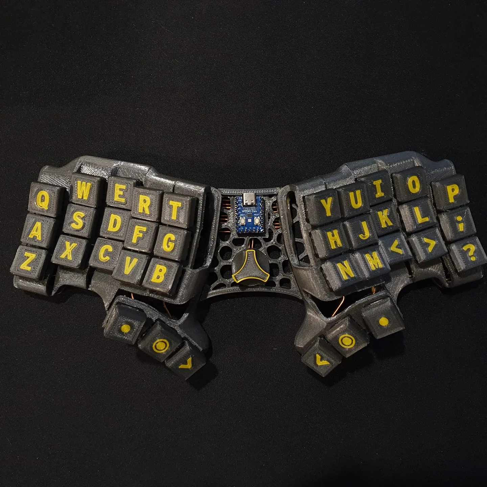

# Skeletyl

Compact and silent Dactyl-like keyboard for ergo lovers.

*picture: trekdemow*

# Required components

## 3d prints

### Important note on V4/V3

The revision 4 of the skeletyl introduces drastic changes with the bottom plate. It reuses the positioning of the screws of the Charybdis Nano, so that the Organic tent can be re-used. It also uses new voronoi-style plates.

When choosing a model to print, be mindful of the version you choose. The files in the `V3` folder are **not** compatible with the V4 case and alien tents. Unless you want to use one of the `V3` mods, we recommend using the latest version `V4`.

### Print files and instructions

The STL files are included in this Github repository, in the `files` folder.

Please find detailed instructions on how to print the case on the online instructions linked below.

| Description      | File                    | Notes                                                                                           |
| ---------------- | ----------------------- | ----------------------------------------------------------------------------------------------- |
| Right case       | `V4/case_v4_vXY.stl`     |    XY version will vary                                                                                     |
| Left case        |                         | Mirror the right case in your slicer                      |
| Right plate      | `V4/plates/plate_v4_vXY.stl` |        XY version will vary                                                                          |
| Left plate       |                         | Mirror the right case in your slicer                      |
| Tent - right     | [Charybdis nano tent](https://github.com/Bastardkb/Charybdis/tree/main/files/3x5%20nano/tent/alien)    | Optional `Alien` tent, use the one from the Charybdis Nano*                                                                         |
| Tent - left      |     | Mirror the right tent in your slicer*                                               |

*If you are printing tents, there are multiple ones available for the Charybdis Nano, and only the `Alien` version is compatible with the Skeletyl V4. There are 30, 15 and 5 degrees versions available.

## Get a kit from BastardKB

You can get a full Kit, including case and all PCBs and electronics required on the shop:
https://bastardkb.com/

If you want to print the case yourself, you can also get just the electronics Kit.

## Electronic components

If you are sourcing the electronic components yourself, you can find a BOM in the [BOM](electronics_bom.md) file.

# Build guide

You can find detailed instruction on the online documentation linked below.

# Links

- Discord: https://bastardkb.com/discord
- Website: https://bastardkb.com/
- Docs: https://docs.bastardkb.com

# Forks

- [Reinforced, increased pinky stagger](https://github.com/dereknheiley/Skeleton-Dactyl-Mini)
- [Navtyl - with 5-way switch](https://github.com/Wimads/Navtyl)
- [skeletyl40 - 5x4 variant](https://github.com/bryankenote/skeletyl40)

# Mods
There are a variety of mods available in the `mods` folder, including a unibody case and chair mounts.

# License 

This work is licensed under a Creative Commons Attribution-NonCommercial-ShareAlike 4.0 International License.

# Versions

V1:

- original version

V2:

- smoother
- Compatible with amoebas and flexible pcbs
- more screws !

V3:

- better stronger screw inserts (added aliexpress link in readme)
- switch to adapter V1.4

V4

- change plate footprint to be compatible with the charybdis nano organic tent
- small visual improvements
- add version numbering on the case and plate