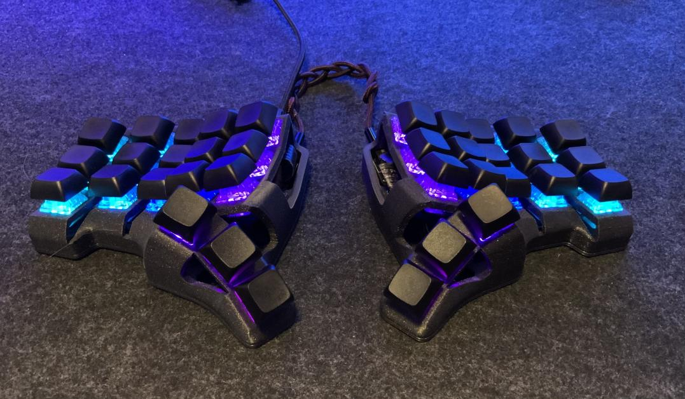
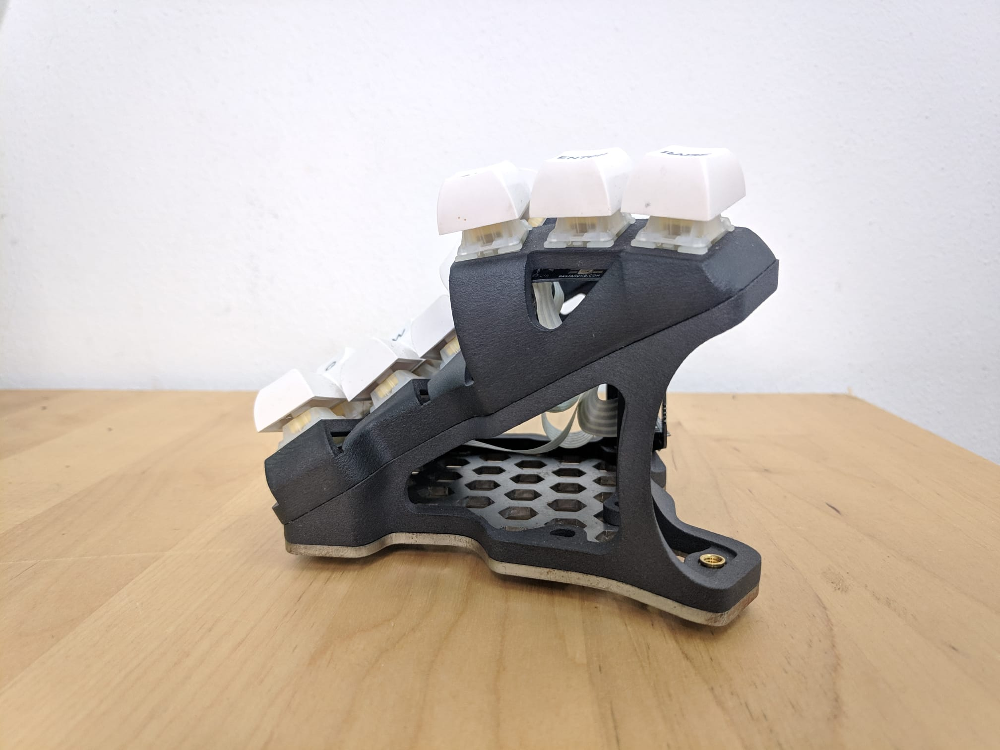
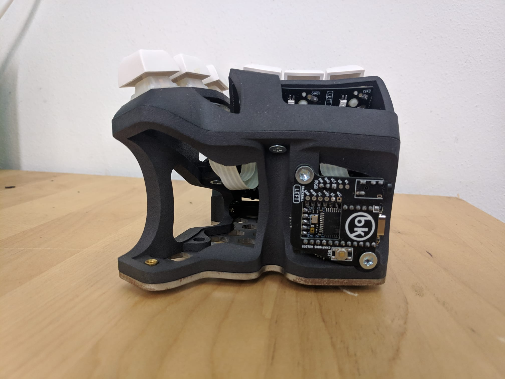
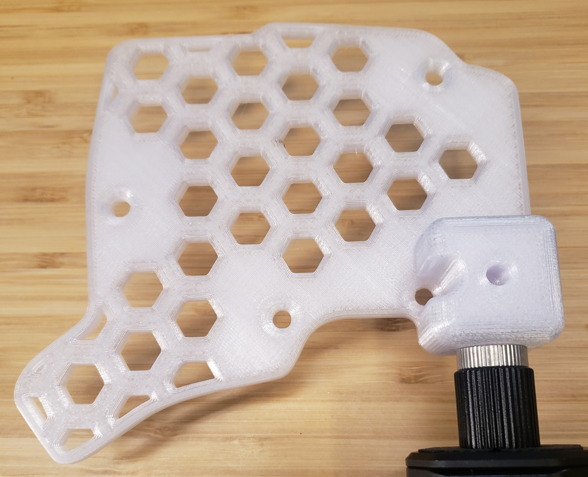

# Skeletyl

Compact and silent Dactyl-like keyboard for ergo lovers.

*picture: trekdemow*

# Sourcing the components

## Electronic components

You will need to order the parts from a shop, and order some PCBs directly from the manufacturer.

Parts list:

| Part name                         | Amount | Link                                                                                    |
| --------------------------------- | ------ | --------------------------------------------------------------------------------------- |
| Flexible PCB for the plate   | 2     | https://github.com/Bastardkb/Skeletyl-PCB-plate                                                        |
| Flexible PCB for the thumbs   | 2     | https://github.com/Bastardkb/TBK-Mini-PCB-thumb-cluster                                                    |
| Elite-C                           | 2      |                                                                                         |
| Elite-C adapter PCB V1.4          | 2      | https://github.com/Bastardkb/Elite-C-holder                                             |
| SOD123 Diodes                     | 36     |                                                                                         |
| Ribbon cables Flexstrip           | 34     | Farnell, Aliexpress                                                                        |
| M4 8mm Torx Screw                 | 12     | Conrad                                                                                  |
| M4 screw insert, M4 X D6.0 X L5.0 | 12     | https://fr.aliexpress.com/item/4000232925592.html?spm=a2g0s.12269583.0.0.6aef4f282LZO4v |
| Audio jack, SMD                   | 2      |                                                                                         |
| Button, 4x4x1.5                   | 2      | https://www.aliexpress.com/item/1005001304569553.html?spm=a2g0s.9042311.0.0.27424c4dDwgcp7 |

If you want RGB, you will also need:

| Part name               | Amount | Format                                |
| ----------------------- | ------ | ------------------------------------- |
| SK6812 Mini-E LEDs      | 36     |                                       |
| Capacitor, 1uF          | 4      | 1206                                  |
| Resistor, 330Ohms       | 4      | 1206                                  |
| Wires                   |        | 28 AWG recommended, Black, Red, Color |
| Ribbon cables Flexstrip | 6      |                                       |

## 3d Parts compatibility

The revision 4 of the skeletyl introduces drastic changes with the bottom plate. It reuses the positioning of the screws of the Charybdis Nano, so that the Organic tent can be re-used. It also uses new voronoi-style plates.

When choosing a model to print, be mindful of the version you choose. The files in the `V3` folder are **not** compatible with the V4 case. Since the V4 was made for homogeneity purposes only and doesn't bring any major improvements, if you want to use any of the `V3` mods that are not translated yet, go for the `V3`.

## Print the case

The STL, STEP and Fusion files are included in this Github.
Feel free to modify them at length. The files are on a non-commercial license, so this is for personal projects only - please do not use those to sell them.

Please find detailed instructions on how to print the case here:
https://docs.bastardkb.com/hc/en-us/articles/360020031180-Print-settings-for-Dactyls

There is also a version that uses a blackpill with its shield PCB, in the `V3/blackpill` folder. The position of the audio jack and usb-c holes are slightly different.

## Print the tents

Optionally, you can print 30 degree tents. Those are removable and attached with screws, and also come with an optional bottom plate.

The tents come in 2 versions: normal, and organic. The organic one provides a sleeker skeleton-style look with a side holder for the shield pcb, but is longer and harder to print.

**Important information**: if you are using the skeletyl V4, there are no normal tents. Instead, the alien tents of the Charybdis Nano should be used - either 15 or 30 degrees.

| Front view               | Side view           |
| ----------------- | ------------------ |
|  |  |

## Get a kit from BastardKB

You can get a full Kit, including case and all PCBs and electronics required on the shop:
https://bastardkb.com/

If you want to print the case yourself, you can also get just the electronics Kit.

# Build guide

Please find detailed build instructions here:
https://docs.bastardkb.com/hc/en-us/articles/360020031340-Kit-contents-and-required-tools

This is for the 6x3, but it will work for this keyboard as well.

# Finding help

- Discord: https://bastardkb.com/discord
- Website: https://bastardkb.com/
- Docs: https://docs.bastardkb.com

# Forks

- [Reinforced, increased pinky stagger](https://github.com/dereknheiley/Skeleton-Dactyl-Mini)
- [Navtyl - with 5-way switch](https://github.com/Wimads/Navtyl)

# Mods
## Chair mount plate  
Alternate bottom plate for mounting to a chair or desk using standard camera mounting equipment. Fits 1/4 inch mounting bolt (1/4-20 UNC).  
  

# Support me on Patreon

If you like the keyboard, please consider helping me with Patreon: https://www.patreon.com/bastardkb

I post regular updates and hindsight on my work. I work full time on keyboard innovation, and this helps a lot !

# License 

This work is licensed under a Creative Commons Attribution-NonCommercial-ShareAlike 4.0 International License.

# Versions

V1:

- original version

V2:

- smoother
- Compatible with amoebas and flexible pcbs
- more screws !

V3:

- better stronger screw inserts (added aliexpress link in readme)
- switch to adapter V1.4

V4

- change plate footprint to be compatible with the charybdis nano organic tent
- small visual improvements
- add version numbering on the case and plate
