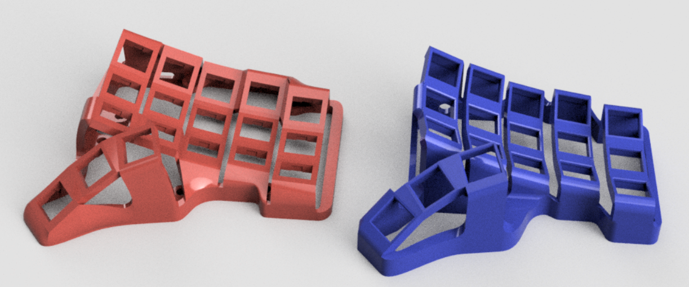
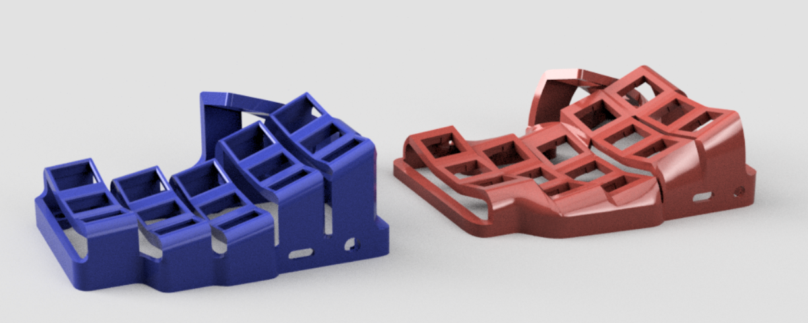

*Skeletyl*

# Skeleton-Dactyl-Mini

Compact and silent Dactyl-like keyboard for ergo lovers.

# Versions

V1:

- original version

V2:

- smoother
- should work with amoebas and flexible pcbs
- more screws !

# Parts list

Work in progress 

| Part name  | Amount |
| ------------- | ------------- |
| Elite-C  | 2  |
| Audio jack  | 2  |
| Screw insert, M4 4mm long | 14  |
| Screw, M4, 10mm, tapered (Torx recommended) | 14  |

# Forks

- [Reinforced, increased pinky stagger](https://github.com/dereknheiley/Skeleton-Dactyl-Mini)

# Pictures

V1 (blue) / V2 (red)

# License 

This work is licensed under a Creative Commons Attribution-NonCommercial-ShareAlike 4.0 International License.
