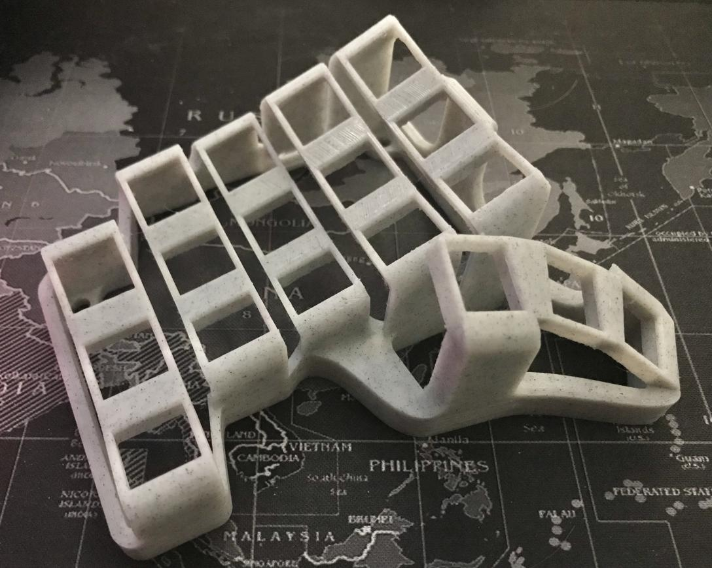

*Skeletyl*

This is a fork of the [Skeletyl] (https://github.com/HID-Technologies/Skeleton-Dactyl-Mini).

# Changes / Design Goals
- Increase pinky column stagger
- Reinforce case connecting pinky column
- (Ambitious) Adjust thumb angles and position
- (Yeah right) make a 3x5 version

# Skeleton-Dactyl-Mini

Made to be used with 

- 4mm tapered screws (optional if not using bottom plate)
- 4mm long screw inserts (optional if not using bottoms plate)
- USB-C microcontroller
- 3.5mm audio jack

This work is licensed under a Creative Commons Attribution-NonCommercial-ShareAlike 4.0 International License.
