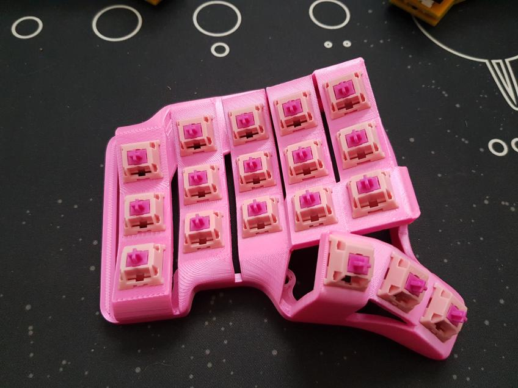
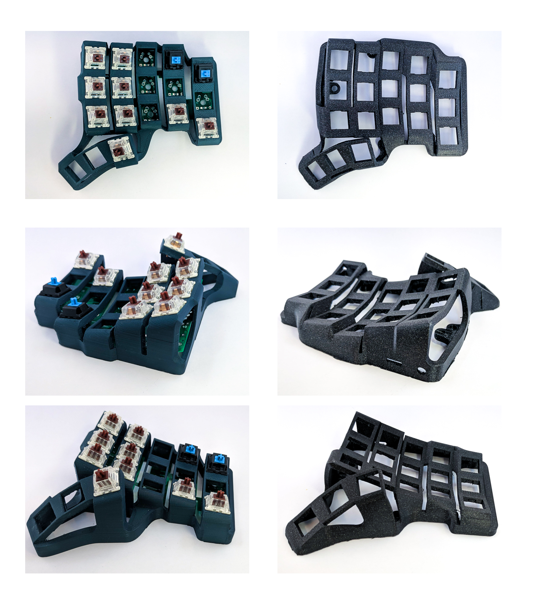
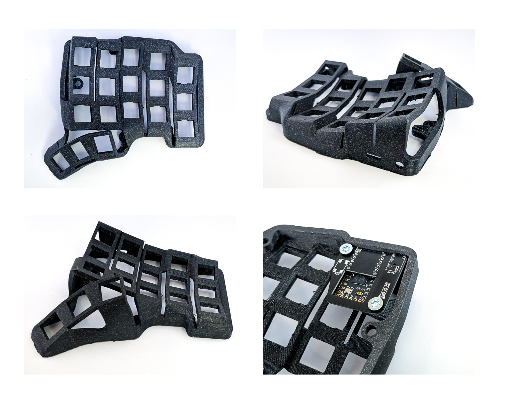

*Skeletyl*

# Skeleton-Dactyl-Mini

Compact and silent Dactyl-like keyboard for ergo lovers.

# Support me on Patreon

If you like the keyboard, please consider helping me with Patreon: https://www.patreon.com/bastardkb

I post regular updates and hindsight on my work. This helps a lot !

# Versions

V1:

- original version

V2:

- smoother
- Compatible with amoebas and flexible pcbs
- more screws !

# Sourcing the components

For sourcing the components, you have two options:

## Source them yourself

You will need to order the parts from a shop, and order some PCBs directly from the manufacturer.

The Elite-C Adapters are open-source. At this moment, the flexible PCBs are not.

**Note: please use Elite-C adapter V1.3**

Parts list:

| Part name  | Amount |  Link |
| ------------- | ------------- | ------------- |
| Amoebas  | 32  | |
| Elite-C | 2  | |
| Elite-C adapter PCB V1.3 | 2  | https://github.com/Bastardkb/Elite-C-holder |
| SOD123 Diodes | 32  | |
| FlexStrip cables | 30  | Farnell |
| M4 8mm Torx Screw | 12  | Conrad |
| M4 screw insert | 12  | Aliexpress |
| Audio jack, SMD | 2  |  |

**Note: the per-key RGB will not work at this point** - or you will need to solder cables to LED pads, this is difficult !!

If you still want RGB, you will also need:

| Part name  | Amount |  Link |
| ------------- | ------------- | ------------- |
| FlexStrip cables | 6  | Farnell |
| 28AWG Cables | 6  | Aliexpress |
| SK6812 Mini-E LEDs | 42  | Aliexpress |

## Get a kit from BastardKB

You can get a full Kit, including case and all PCBs and electronics required on the shop:
https://bastardkb.com/

If you want to print the case yourself, you can also get just the electronics Kit.

# Sourcing the case

The STL, STEP and Fusion files are included in this Github.
Feel free to modify them at length. The files are on a non-commercial license, so this is for personal projects only - please do not use those to sell them.

For sourcing the case, you have two options:

## Print it yourself

Please find detailed instructions on how to print the case here:
https://docs.bastardkb.com/hc/en-us/articles/360020031180-Print-settings-for-Dactyls

## Get a case from BastardKB

If you want a case, please contact me directly through the website.

The cases are printed at 0.15 mm layer height using Prusament Galaxy Black on a Prusa MK3s.

I check and post-process each case individually to make sure it matches very high quality standards.

# Build guide

Please find detailed build instructions here:
https://docs.bastardkb.com/hc/en-us/articles/360020031340-Kit-contents-and-required-tools

This is for the 6x3, but it will work for this keyboard as well.

# Forks

- [Reinforced, increased pinky stagger](https://github.com/dereknheiley/Skeleton-Dactyl-Mini)

# Pictures

V1 / V2

V2

# License 

This work is licensed under a Creative Commons Attribution-NonCommercial-ShareAlike 4.0 International License.
