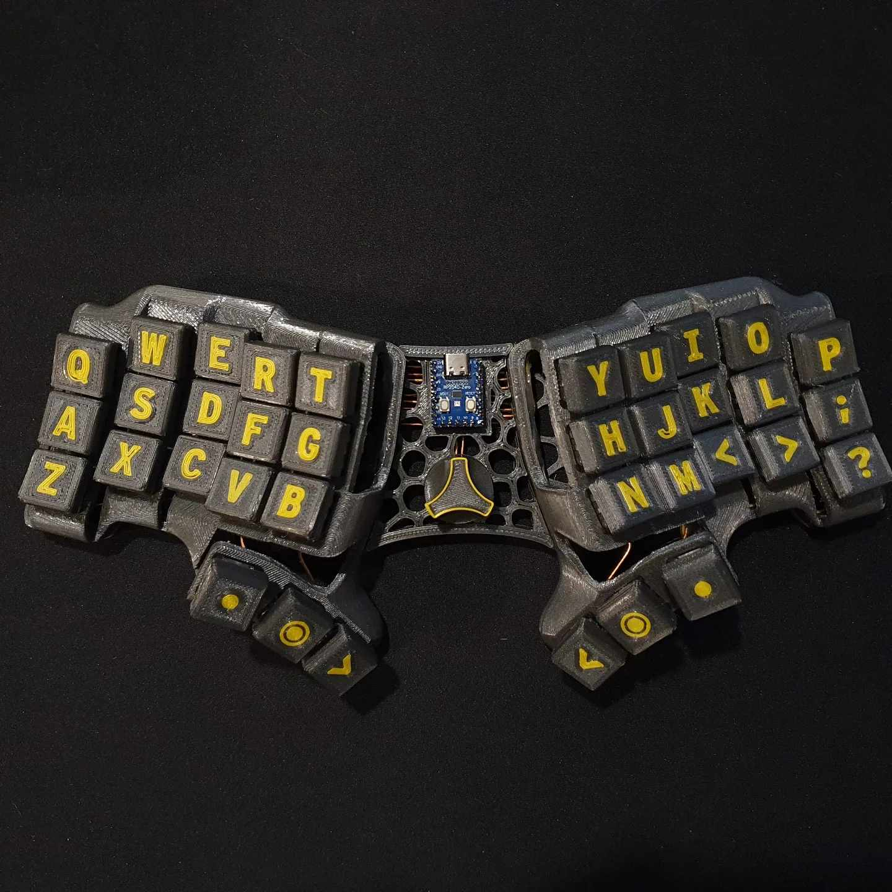
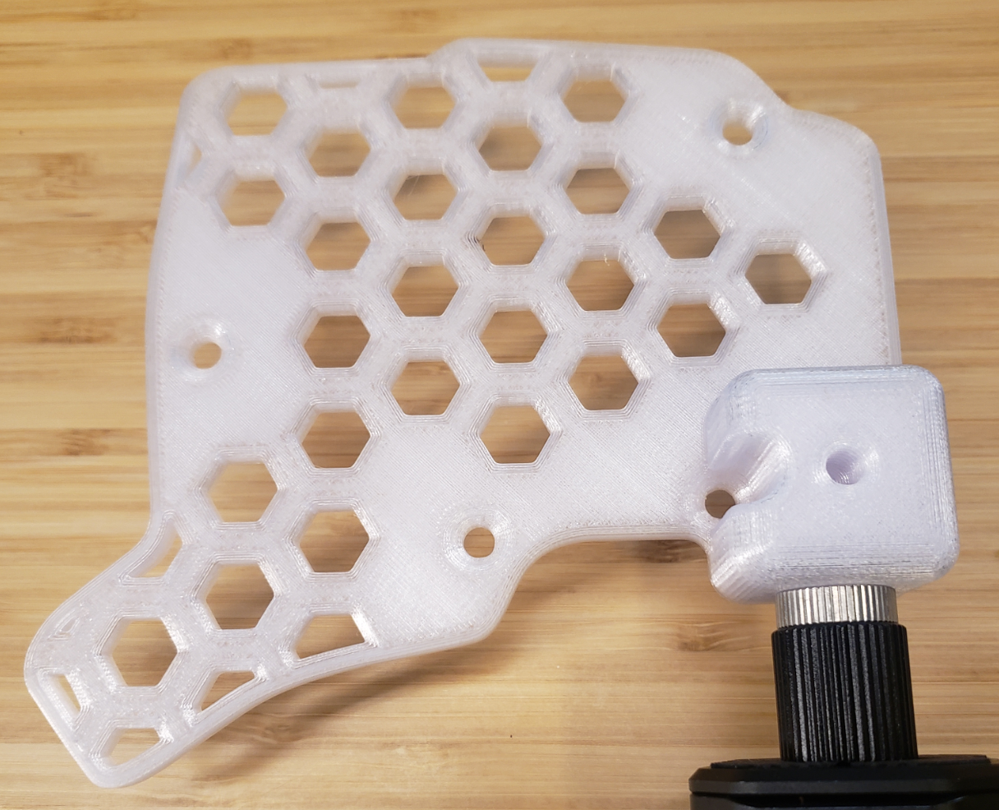

# Table of contents

- [Table of contents](#table-of-contents)
- [Magsafe](#magsafe)
- [Unibody](#unibody)
- [Chair mount plate](#chair-mount-plate)
  - [V4 version plate](#v4-version-plate)
  - [V3 version plate](#v3-version-plate)
- [Pro micro mod](#pro-micro-mod)

# Magsafe

Is's possible to add tenting to your keyboard by using magsafe magnets and tripods.

The `magsafe` folder contains:
- STL files meant to be 3d printed and used with magnet stickers
- A DXF file meant to be laser cut

If you are ordering laser-cut plates, make sure to use a magnetic material such as steel.

# Unibody

*What if split keyboard, but not split?*

Files are in the `unibody` folder, including a holder for a RP2040 zero and a pro micro.j

# Chair mount plate  
## V4 version plate
Requires a 1/4-20 UNC heat insert. Standard 1/4 inch camera mount thread.
There is a version with bumpon stands so the keyboard can sit flat on a surface when not mounted.

## V3 version plate  
Alternate bottom plate for mounting to a chair or desk using standard camera mounting equipment. Fits 1/4 inch mounting bolt (1/4-20 UNC).  
  

# Pro micro mod

3d printable files to hold a pro micro in place of the splinktegrated PCB.

Files are in the `pro micro` folder.

# Tent plate

A solid tent made to house a battery. Connects to the standard plate at the bottom. 